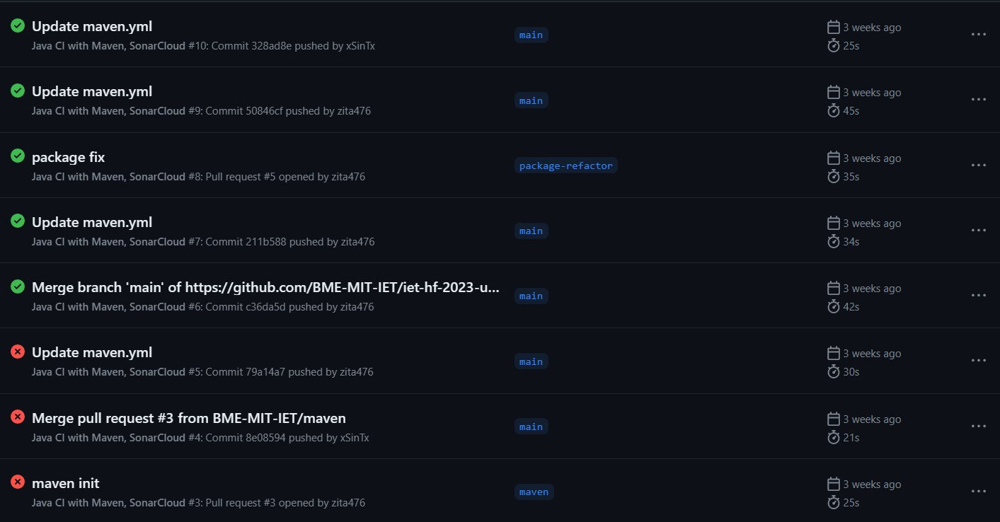
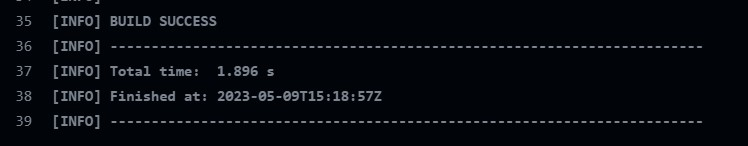

# Build és CI beüzemelése

## Maven

A projektben nem volt build folyamat automalizálás támogatás. A projekt mérete nem volt nagy, ezért a maven-t választottuk a gradle-el szemben. Annak ellenére, hogy a gradle személyre szabottabb konfigurációja több mindent biztosított volna és flexibilisebb, a maven pont az egyszerűsége miatt tökéletes volt számunkra. 

## GitHub Actions

A CI támogatás sem volt a projekthez, a legkézenfekvőbb választás a GitHub Actions volt, mivel a verziókezelést is itt oldottuk meg.

## Elvégzett munka

A legelső lépésként próbáltuk beüzemelni a maven-t. Több hibába is belefutottunk, mivel a projekt struktúrája nem volt megfelelően előkészítve, hogy minden gördülékenyen menjen. A pom.xml fájlt készítettük el a maven oldalának megfelelően, illetve maven wrapper-t is hozzáadtunk, hogy saját gépeken is tudjuk a maven-t használni. Utána a GitHub Actions 'Java with Maven' opciójával dolgoztunk tovább, ami legenerálta nekünk a kész maven.yml fájlt. Le is futott a projektre, de sajnos itt újra belefutottunk a projekt rossz package szerkezetének hibájára. Ezt javítottuk, ami elég időigényes volt, de végre sikeresen lefutott és nem dobott hibát. Utána még írtunk egy unit test-et, hogy ellenőrizzük, hogy a tesztek is láthatóak már.

## Eredmények

A GitHub Actions-ben, a kezdeti projektből fakadó problémákat leküzdve sikeresen lefutott folyamatok.



## Tanulságok

```

Fontos a projektet letisztultan és áttekinthetően tartani, mert a munkát nagyban segíti, ha nem kell a package rendszer miatt órákat eltölteni annak javításával.

Az automatizálása a folyamatoknak (maven) segít, hogy rögtön visszajelzést kapjunk a kódunkról. A legtöbb amit a többi feladatban használtunk ennek köszönhetően lett a projekt segítségére.

```