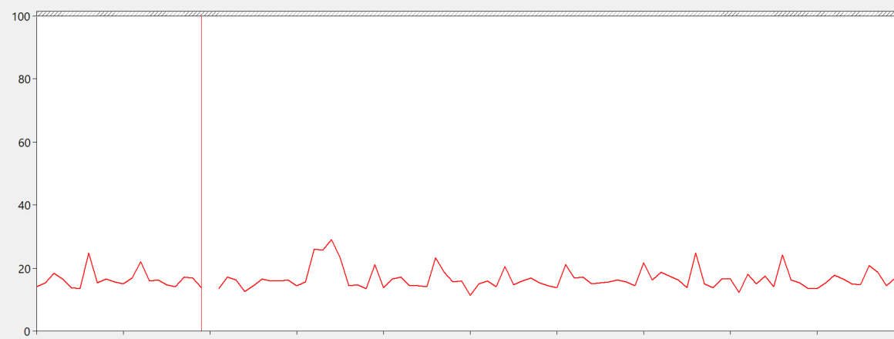
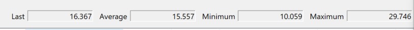
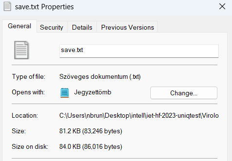
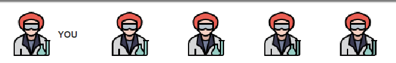
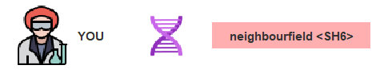
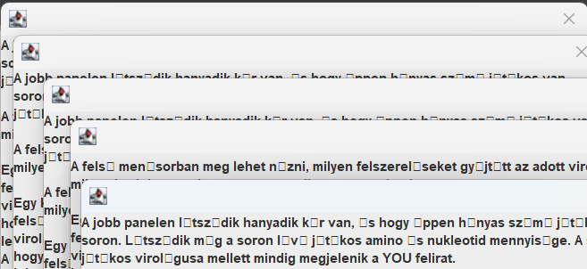

# Nem-funkcionális jellemzők vizsgálata

## Teljesítmény

A játék teljesítményének vizsgálata során hosszabb ideig monitoroztuk a CPU és memória kihasználtságot. A program futása közben, a legtöbb funkciót használva, se a cpu kihasználtságban, se a memória használatban nem történt jelentős növekedés.

A játék menthető fájlba is ami szintén nem foglal nagy tárhelyet és a mérete nem függ a játék aktuális állapotától,

## Használhatóság / Felhasználói élmény

A játék felületén a működéshez szükséges minden elem elérhető, viszont a maga felület nem túl felhasználóbarát és design szempontból sem a legelőnyösebb.

Jelentősebb problémák:

- Összes játékos megjelenítése egyforma (kivéve a saját karakterünk, ezt felirat jelzi), így nehezen nyomonkövethető melyik játékosokkal állunk egy mezőn vagy lépünk interakcióba.

- A legtöbb történésről, user action-ök sikerességéről például egy szomszédos mezőre lépésrpl, vagy genetikai kód megtanulásáról nem érkezik visszajelzés, így a játék néha nehezen követhető.

- A felhasználók által használható funkciók elérése alapvetően nem intuitív, (Például egy ágens készítéséhez a genetikai kód nevére kell kattintani, majd sikeres művelet esetén az ágens egy másik lenyitható fülön jelenik meg). Viszont a játékoz tartozik egy súgó, ami a legtöbb ilyen esetre választ ad, így ezzel a játék könnyebben tanulható.
- A súgó többszöri kattintás esetén, mindig újabb ablakban jelenik meg, melyeket csak egyesével lehet bezárni, emellett a magyar karakterek nem mindig jelennek meg megfelelpen, ami jelentősen rontja a felhasználói élményt.

