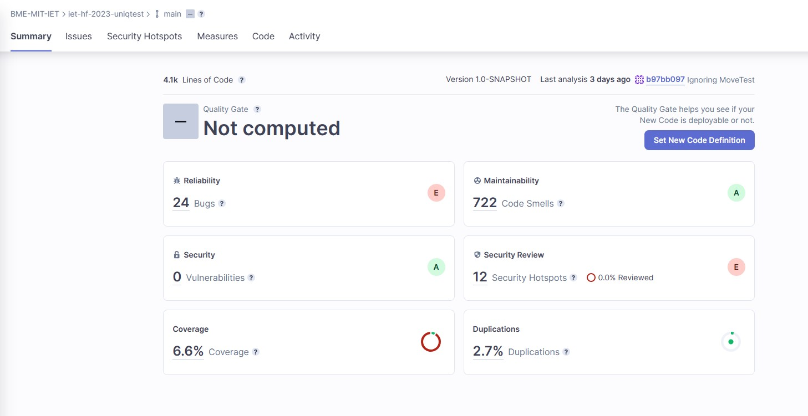
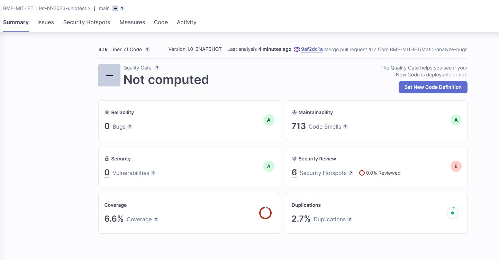
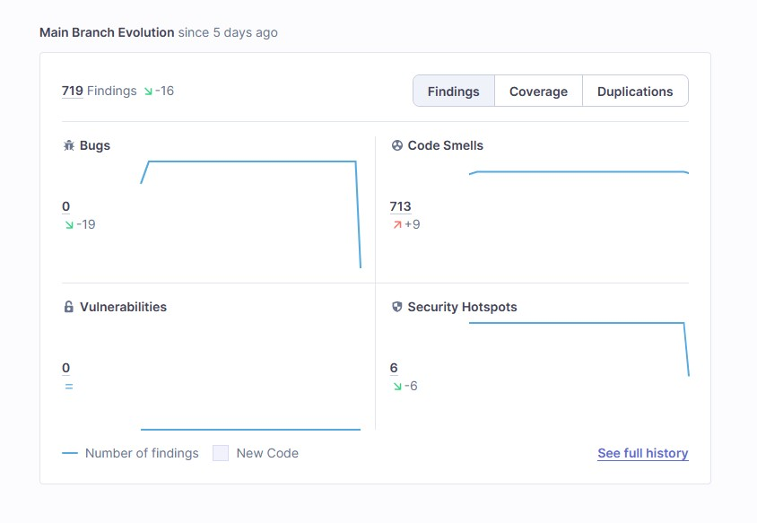

# 📈Statikus analízis

## SonarCloud

A projekt megvalósítása során a SonarCloud-ot választottuk, mint statikus analízis eszköz. 

Fontos volt, hogy a kódminőségén javítsak és szemléletesnek láttam a SonarCloud-ba használt jelentéseket, diagrammokat.
Integráltam még a build folyamatba is, így automatikusan generálódtak a jelentések.

## Elvégzett munka

Miután megkaptam az engedélyt volt lehetőség a SonarCloud-ot a projektbe integrálni. Először a pom.xml 'properties'-t egészítettem ki a megfelelő sonar.* tulajdonságokkal. A Secrets fülön hozzá kellett adnom a SonarCloud oldalon megjelenő SONAR_TOKEN titkot. Ekkor már volt maven konfigurációnk (maven.yml), amit kiegészítettem a megfelelő sorokkal. Így a build folyamatnak is része lett, generálódott jelentés is.

## Változtatások

Az alábbi bugokkal találkoztam: 
- Save and re-use Random - A legtöbb esetben a programban mindig újra példányosított Random osztállyal dolgoztak.
- Use try-with-resources or close this "ObjectInputStream" in a "finally" clause és FileInputStream - az ObjectInputStream és FileInputStream a close() hívás nem megfelelő helyen volt.
- Null safe equals - == használt, ahol equals-re lett volna szükség, itt Object.equals-t használtam, ezzel is elkerülve a NullPointerExceptions-t.
- InterruptedException - Üres catch ág benne az InterruptedException.
- Change this condition so that it does not always evaluate to "false" - Volt a game-nek egy null vizsgálata, amit előtte már létrehozott így sosem futott rá arra a kódrészletre.
- A "NullPointerException" could be thrown; "virologist" is nullable here. - A virologist objektumot nullra állította, majd utána ennek a függvényét hívta meg.

Ezután a Security Hotspots számát próbáltam csökkenteni a már bugmentes kódon belül. Az eredmény ekkor ez lett:

## Eredmények

## Tanulságok
