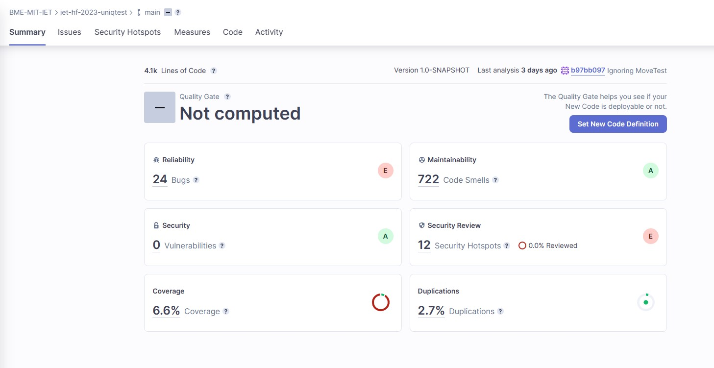
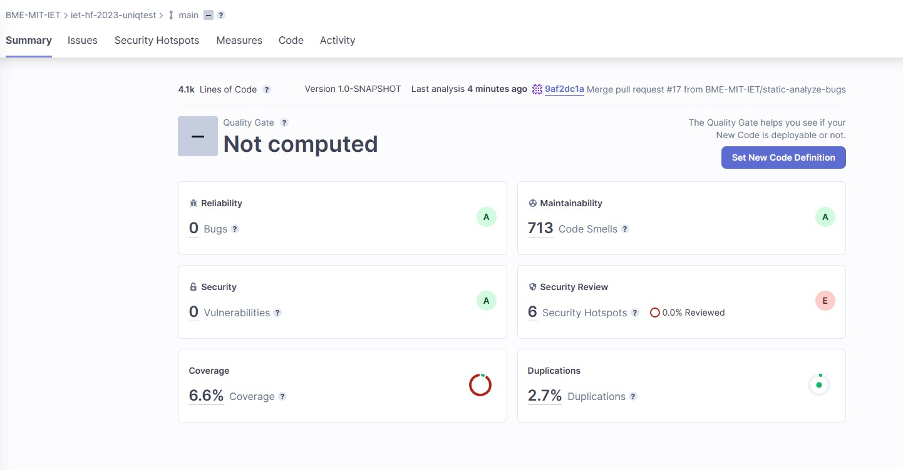
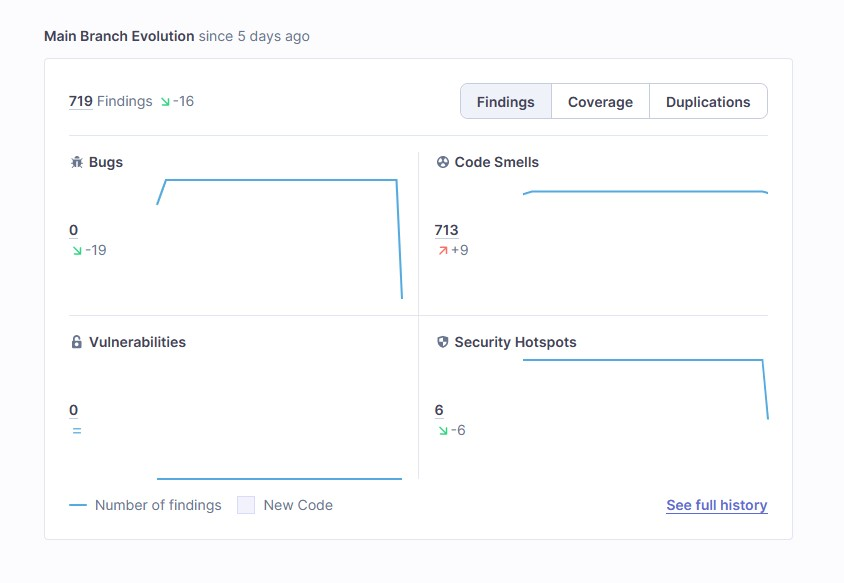
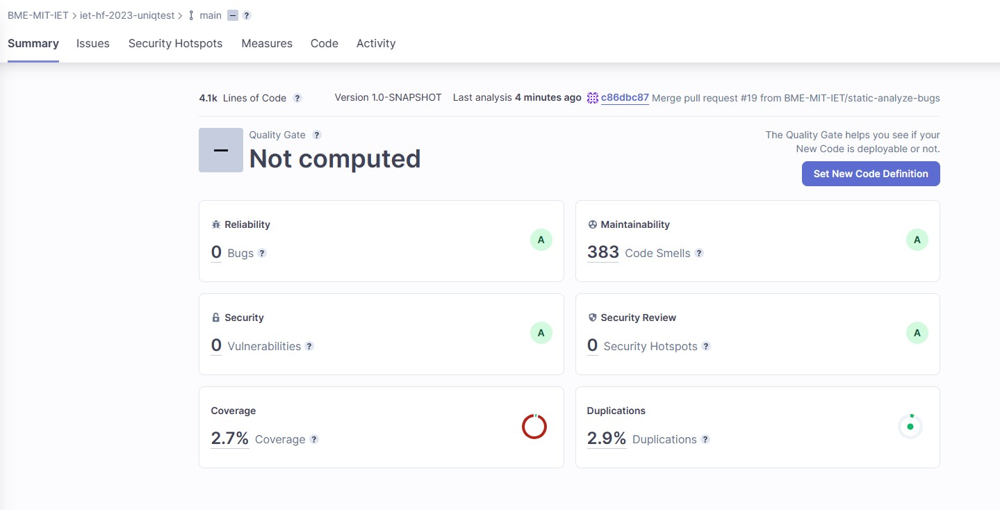
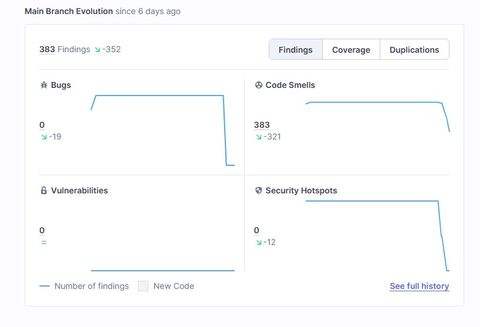

# 📈Statikus analízis

## SonarCloud

A projekt megvalósítása során a SonarCloud-ot választottuk, mint statikus analízis eszköz. 

Fontos volt, hogy a kódminőségén javítsak és szemléletesnek láttam a SonarCloud-ba használt jelentéseket, diagrammokat.
Integráltam még a build folyamatba is, így automatikusan generálódtak a jelentések.

## SonarLint

A Code Smell-ek keresése során nagyban segítette a munkám, hogy gyorsabban megtaláljam a hibákat, illetve a leírás is rendelkezésre állt a fejlesztőkörnyezetben a problémákról.

## Elvégzett munka

Miután megkaptam az engedélyt volt lehetőség a SonarCloud-ot a projektbe integrálni. Először a pom.xml 'properties'-t egészítettem ki a megfelelő sonar.* tulajdonságokkal. A Secrets fülön hozzá kellett adnom a SonarCloud oldalon megjelenő SONAR_TOKEN titkot. Ekkor már volt maven konfigurációnk (maven.yml), amit kiegészítettem a megfelelő sorokkal. Így a build folyamatnak is része lett, generálódott jelentés is.



## Változtatások

Az alábbi bugokkal találkoztam: 
- Save and re-use Random - A legtöbb esetben a programban mindig újra példányosított Random osztállyal dolgoztak.
- Use try-with-resources or close this "ObjectInputStream" in a "finally" clause és FileInputStream - az ObjectInputStream és FileInputStream a close() hívás nem megfelelő helyen volt.
- Null safe equals - == használt, ahol equals-re lett volna szükség, itt Object.equals-t használtam, ezzel is elkerülve a NullPointerExceptions-t.
- InterruptedException - Üres catch ág benne az InterruptedException.
- Change this condition so that it does not always evaluate to "false" - Volt a game-nek egy null vizsgálata, ezt a game-t előtte már létrehozta így sosem futott rá arra a kódrészletre.
- A "NullPointerException" could be thrown; "virologist" is nullable here. - A virologist objektumot nullra állította, majd utána ennek a függvényét hívta meg.

Ezután a Security Hotspots számát próbáltam csökkenteni a már bugmentes kódon belül. Az eredmény ekkor ez lett:






## Eredmények

Ezután a code smellekkel foglalkoztam, azok számát próbáltam csökkenteni. Itt használtam már a SonarLint-et. 


Néhány code smell kiemelve, amivel nagyobb számban találkoztam és javítottam:

### Major
* Public helyett használjunk protected láthatóságot abstract classnál
* Felesleges kommenteket törölni kellett
* "@Override" annotáció nem volt a függvényeken
* Voltak nem használt függvény paraméterek
* Ha elhagyjuk a {}-ket, akkor olvashatatlan lesz a kód és bugokat okozhat a működésben
* Utility class-nak ne legyen public láthatóságú konstruktora

### Critical
* Legyen az interface/osztály tranziens vagy szerializálható
* Eltávolítani a non-escaped \u0009 karaktert a literálból.
* Konstans bevezetése ahelyett, hogy a "................" literált 36-szor megismételné.
* Statikus hozzáférés (a „javax.swing.WindowConstants”) az „EXIT_ON_CLOSE” beállításhoz.

### Minor
* Ne tároljuk ideiglenes lokális változóban az értéket, hanem return-el adjuk vissza rögtön
* Át kellett helyezni a []-t a típusba
* pl.: A "getId" az "Effect" interfacebe van definiálva, és eltávolítható ebből az osztályból
* Lecserélni típusspecifikációt a diamond operátorral ("<>").
* Az isEmpty() ellenőriztem, hogy a gyűjtemény üres-e vagy sem.
* pl.: Deklaráltam az "nSteal"-t egy külön sorban, az olvashatóság miatt.
* pl.: Eltávolítottam a nem használt „main.java.iet.Equipments.Equipment” importálást.
* Eltávolítottam a nem használt "interactVirologist" lokális változót.

### Blocker
* A metódus neveinek nem szabad megegyeznie vagy csak a nagybetűben különböznie.

Illetve a maradék Security Hotspots hibát javítottam (printStackTrace() használata logger helyett).

A javítás után az alábbi eredményeket sikerült elérni:





---
## Tanulságok

- A code smell-nél fontos volt, hogy fejlesztői környezetbe (SonarLint) is legyen segítség, mert volt hogy javítottam egy hibát, aztán egy újabb került elő.
- A SonarCloud részletezte a különböző hibákat, megoldását, ezek hasznos segítségként szolgáltak. A kódduplikációkat is fel lehetett fedezni benne.
- Nagyon sok code smell volt a kódban, a legtöbb viszont hasonló volt, így viszonylag nagy mennyiségben lehetett őket javítani. 
    

```
Tényleg fontos a kód olvashatóságának, karbantarthatóságának megőrzése, mert a későbbi munkát nagyban segíti, ha a kód minőségére is fordítunk megfelelő mennyiségű időt.
```

---
