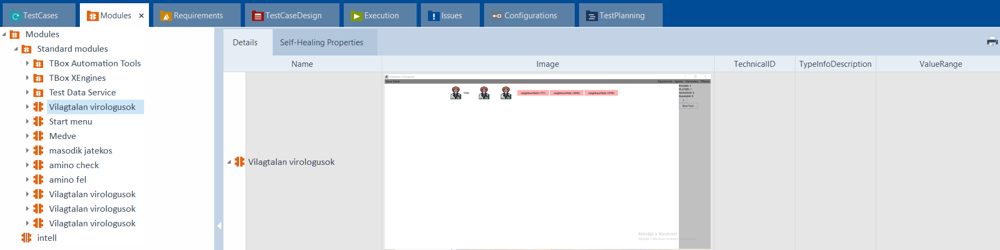
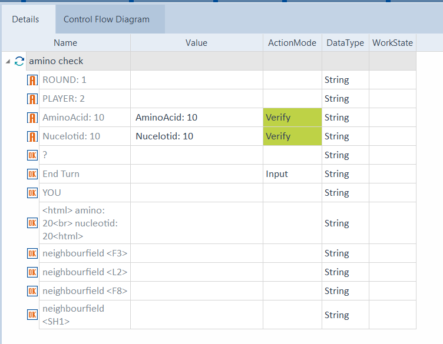
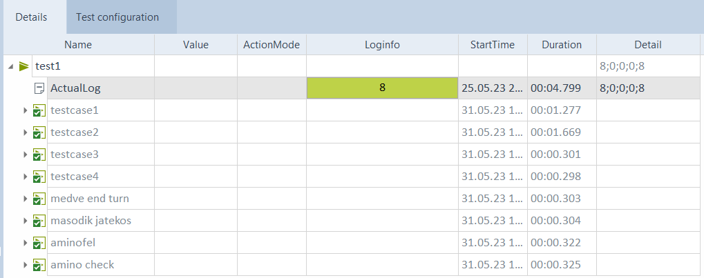

A UI teszteléshez utánanéztünk a felsorolt 3 opciónak, majd a projekt fajtája miatt a Tosca alkalmazást választottuk.   
Ebben készítettünk egy új tosca projektet. A játékot úgy kellett tesztelni, hogy bescanneltünk különböző képernyőket, amiket tesztelni szerettünk volna, a tosca beépített tooljával. (Ezek lettek a modulok)  
 
Ezután a tesztesetekhez hozzáadtuk azokat, amiket hasznosnak gondoltunk, majd megadtunk hozzá értékelés kritériumokat, illetve akciókat. Például, hogy amikor az End Turn-re kattintás után valóban a következő játékos következik-e a kiírás alapján.   

 

Készítettünk több ilyen tesztesetet, úgy, hogy folyamatos legyen, tehát az egymás után következő tesztesetek valóban egymás után következhessenek a játékban.  
Ezeket a teszteseteket futtattuk az Execution fülön. Ekkor magától letesztelte a UI működését a tesztesetek szerint az alkalmazás, majd kiadta az eredményt összesítve, és tesztesetenként is.  
A tesztelést megnehezítette, hogy rengeteg funkció a lenyíló füleknél ellenőrizhető, ezt pedig a Tosca nem megfelelően scannelte be. De a tesztelhető funkciók működtek: 
<ul>
<li>A játék megfelelő indítása (játékos megadása, és Start Game gomb a megfelelő mennyiségű játkossal indít játékot.)</li>
<li>A játék indításakor megfelelőek az adatok: 1. kör, 1. játékos, 0 aminosav, 0 nukleotid.</li>
<li>A játékos lépése: A játékos kattintásra a megfelelő mezőre kerül. (Ezt a gomb Input mezőre váltásával csináltuk)</li>
<li>A játékos körének befejezése: a játékos az End Turnre kattint, ekkor a következő játékos következik.</li>
<li>A játékos anyagfelvétele: mikor a játékos mezőről anyagot vesz fel, az a mezőről eltűnik, megjelenik a játékos inventoryjában.</li>
<li>stb.</li>
 
</ul>